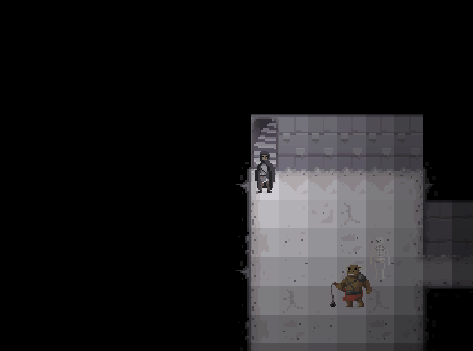

# DungeonRaider

A top-down action RPG prototype with a procedural dungeon, written in F# and MonoGame.

    

The prototype includes:

- Procedural generation of a dungeon using a Binary Space Paritioning algorithm
- A controllable player character, animated, with strike, being hit, walking and dying animations
- Two mapped monster characters similar to the player, a minotaur and a skeleton. The monsters pursue the player when close.
- Movement using Astar search
- Primitive lighting, using a distance algoritm and shading

At present, this prototype is going to be left as is. The game kind (top down action RPG) is not really what I want to make going forward, it was more of a coding experiment and a stress test of my evolving monogame wrapper (fsharp-gamecore).

Possible next steps if I was to continue would be:

- Line of sight lighting, so that you can't see rooms through walls
- A simplified BSP algorithm, easier to understand and more efficient
- Placement of monsters
- Treasure
- Multiple levels
- Interface, menus etc

But I probably won't do the above. If you like, consider them an exercise for the reader.

## Development and Running

This project was developed using dotnet core 2.1 and VS Code. It should work on all platforms supported by dotnet core. If you are not running windows however, you might run into problems when building the content pipeline (something out of my control, being a monogame thing). If you do encounter issues, please try and follow the steps [here](https://github.com/ChrisPritchard/Tetris/blob/master/README.md#supported-platforms).

## License/Credit/Acknowledgements

The code is all under the __Unilicense__. Do with it as you will.

The prototype makes use of two libraries that I wrote, <https://github.com/ChrisPritchard/fsharp-gamecore> and <https://github.com/ChrisPritchard/astar-search>. Both are on nuget (which is how they are referenced), and their code is also available under the __Unilicense__.

All texture content is sourced from <http://opengameart.org>, primarily from a user called Calciumtrice: <https://opengameart.org/content/dungeon-tileset-1>.
These textures are provided under the __Creative Commons Attribution 3.0__ license.

 The font used is 'Connection', from here: <https://fontlibrary.org/en/font/connection>. This font is provided under the **SIL Open Font License**, a copy of which lies in the root of this repository.

## Note on development sequence

This project was developed after __DungeonRaider__ [here](https://github.com/ChrisPritchard/DungeonRaider).